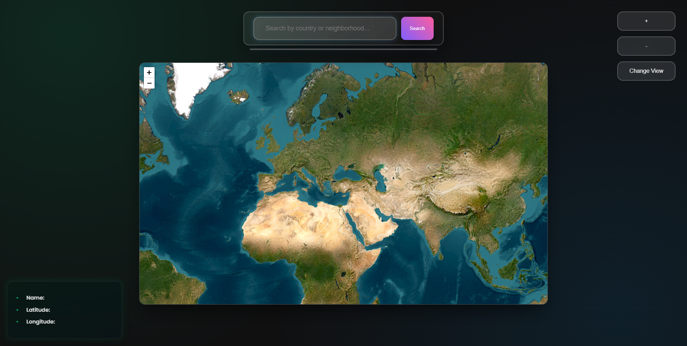

# Real-Time Satellite View 🌍

Welcome to the **Real-Time Satellite View** project! This web application provides real-time satellite imagery and allows users to explore locations on Earth through an interactive map. Powered by **Leaflet.js** and **OpenStreetMap**, this project allows for seamless exploration of the globe with easy-to-use controls for zooming, changing views, and viewing location information.

## 📖 Project Overview

The project leverages the **Leaflet API** to display live satellite imagery and allows users to interact with the map in real-time. Users can search for locations, zoom in and out, switch between satellite and street views, and get detailed information about the selected location, such as coordinates and name.

### Key Features:
- **Interactive Map**: Real-time satellite and street views.
- **Search Functionality**: Search locations by country, city, or neighborhood.
- **Dynamic Location Info**: Displays the name, latitude, and longitude of the selected location.
- **Zoom Controls**: Zoom in/out for better map navigation.
- **View Toggle**: Switch between satellite and street views with a single click.

## 🎮 User Interface

The interface of the site is designed to be simple, intuitive, and interactive. The core components of the site include:

1. **Search Bar**: Users can input the name of a place (e.g., a country or city) to find and zoom into it on the map.
2. **Map**: The central feature of the site, displaying satellite imagery and allowing users to interact with it.
3. **Location Info Box**: Displays detailed information about the selected location, including the name, latitude, and longitude.
4. **Control Buttons**: Includes zoom in, zoom out, and toggle view options to enhance user experience.

  

## 🛠️ Installation

To get this project up and running on your local machine, follow these steps:
